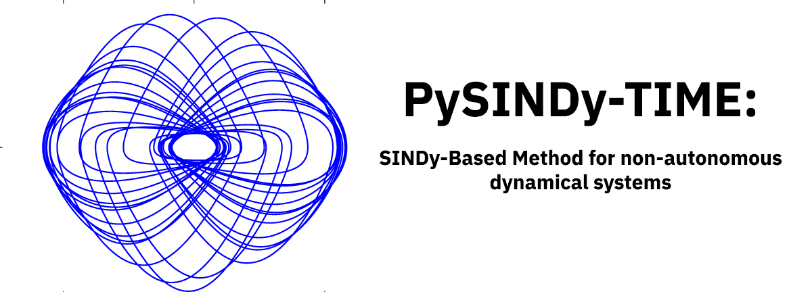
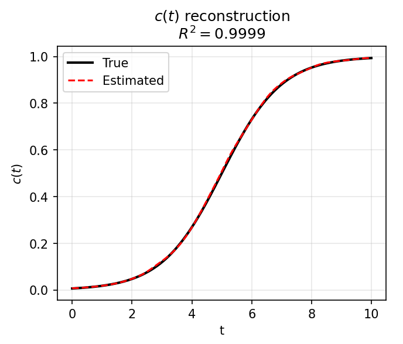
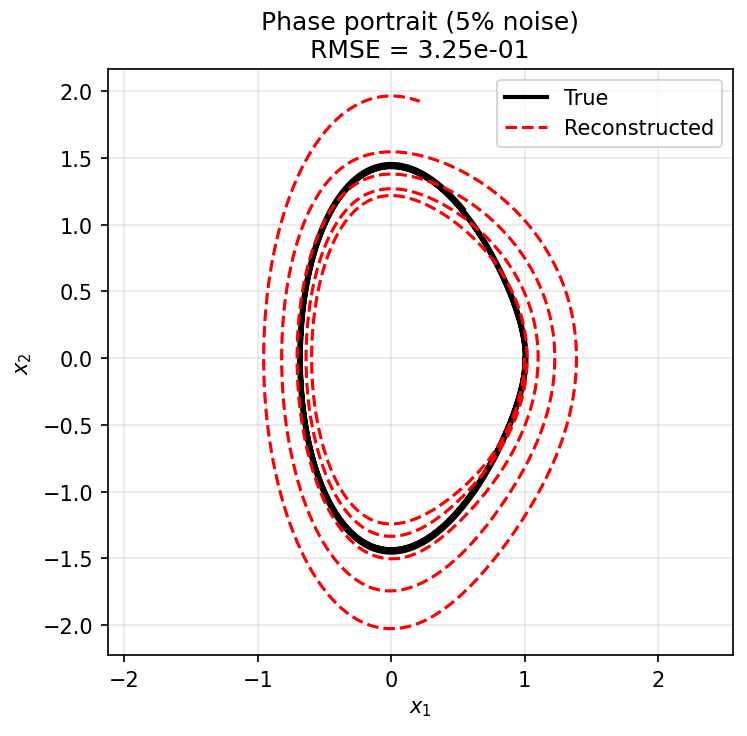
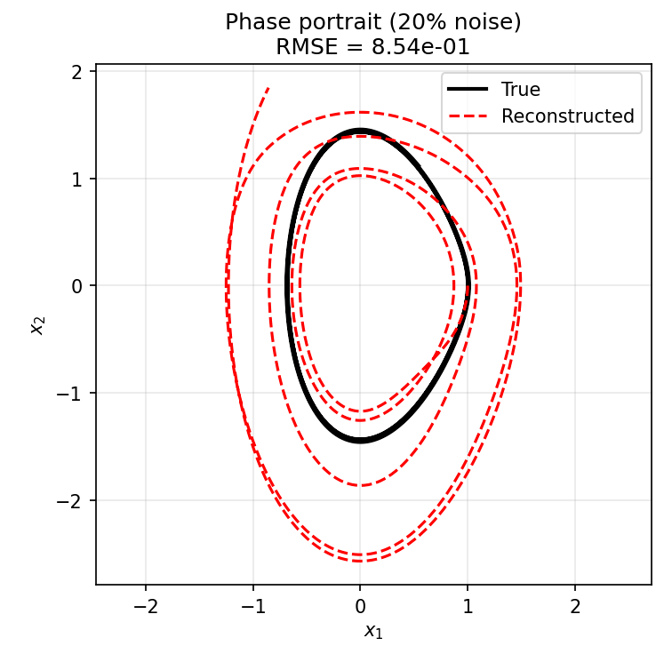
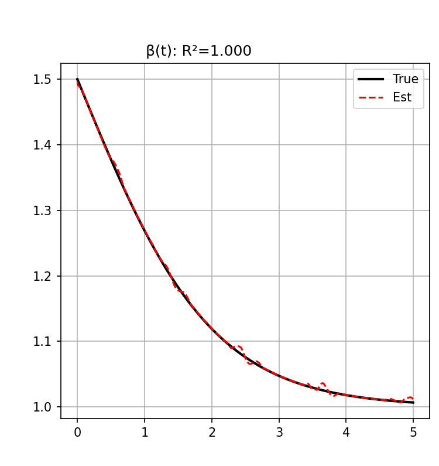
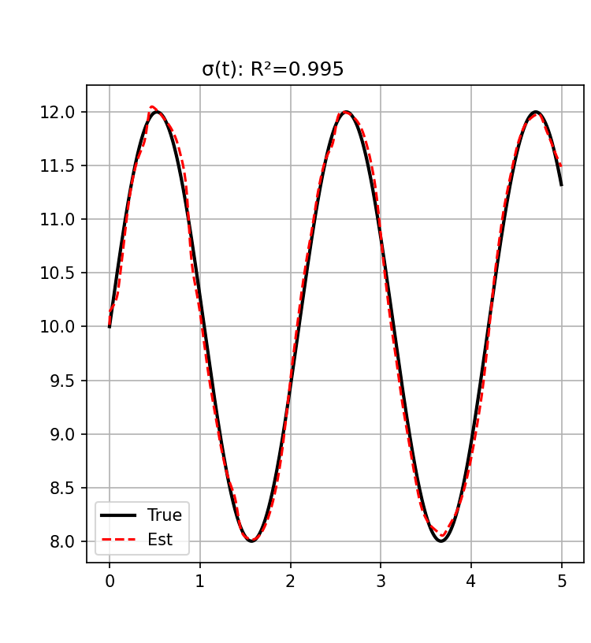
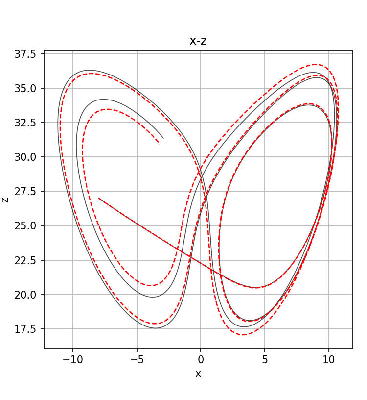

# PySINDy: Time-robust

This repository contains a brand new method for non-autonomous dynamic system recovery from data based on PySINDy package.
Our method is focused on approaching dynamical systems that preserve non-autonomous structure:

$$
\dot{X} = A(t) X
$$

The algorithm is based on locally-weighted regression and backfitting approach:

<p align="center">
  
</p>


$$
\hat{\Xi}_t = \arg\min_{\Xi \in \Omega}
\dfrac{1}{H} w_{t1} \left[ ( \dot{X}_1 - \Theta(X_1')\,\Xi )^2 + \tau ( w_{t1} - w_1^{\text{init}} )^2  + \dfrac{1}{H} \sum_{j=2}^{T} w_{tj} ( \dot{X}_j - \Theta(X_j')\,\Xi )^2 + \dfrac{\lambda_H}{H} \lVert \Xi \rVert_1\right]
$$

The backfitting approach helps to reduce the impact of constant coefficients in coupled statement, and allows to separate dynamics by sequential substraction of impacts from constant and non-autonomous parts.

> :warning: This project is under active development, for stable version please, visit original version: https://github.com/dynamicslab/pysindy.

## Special installation procedure

* Classical procedure:

```bash
git clone git@github.com:Alexander-ha/pysindy_time.git  # (or git clone https://github.com/Alexander-ha/pysindy_time.git)
cd pysindy_time
python3 -m venv pysindy_env

source pysindy_env/bin/activate

pip install --upgrade pip
pip install -r requirements.txt
pip install -e .
```

* Using venv and makefile (**Recommended**):

```bash
make install

source pysindy_env/bin/activate

make fixed_run # for example
```

* via Docker:

```bash
docker build -t pysindy-time .

docker run pysindy-time

docker run -e EXAMPLE=example.py pysindy-time
```

---

## Examples


### Basic example
$$
\begin{cases}
\dfrac{dx}{dt} = c(t) \cdot y \\
\dfrac{dy}{dt} = c(t) \cdot x
\end{cases}
$$

where

$$
c(t) = \frac{1}{1 + e^{-(t-5)}}
$$

<p align="center">
  
  &nbsp;&nbsp;&nbsp;
  
</p>

<p align="center">
  <em>Figure 2. (a) Reconstruction of c(t); (b) Phase portrait.</em>
</p>


To launch the example: 
```bash
cd examples/
python3 tv_simple_ode.py
```

### Mathieu equation
$$
\begin{cases}
\dot{x1} = x_2 \\
\dot{x2} = -\omega_1^2((1 - \delta_s) - \delta_d \cos\theta t)x_1
\end{cases}
$$

To launch the example: 
```bash
cd examples/
python3 cyclicbeamcheck.py #or cyclicbeamchecknoise.py for noise robustness test
```

<p align="center">
  
  &nbsp;&nbsp;&nbsp;
  
</p>

<p align="center">
  <em>Figure 2. (a) mathieu recon. with 5 percent noise (b) mathieu recon. with 20 percent noise</em>
</p>


### Non-autonomous Lorenz-system recovery
$$
\begin{cases}
\dot{x} = \sigma(t) (y - x) \\
\dot{y} = x(\rho - z) - y \\
\dot{z} = xy - \beta(t) z
\end{cases}
$$

where

$$
\sigma(t) = 10 + 2\sin(3t), \qquad
\beta(t) = 1 + \frac{1}{1 + e^{t}}, \qquad
\rho = 28
$$
```bash
cd examples/
python3 time_var_LORENZ.py
```
<p align="center">
  
  &nbsp;&nbsp;
  
  &nbsp;&nbsp;
  
</p>

<p align="center">
  <em>Figure 3. (a) Coefficient 1 time-varying reconsturction; (b) Coefficient 2 time-varying reconsturction; (c) Phase portrait in x-z plane.</em>
</p>


---

**PySINDy** is a package for system identification, primarily revolving around the method of Sparse Identification of Nonlinear Dynamical systems (SINDy) method introduced in Brunton et al. (2016a). It also includes other methods from related literature.

*System identification* refers to the process of using measurement data to infer the governing dynamics. Once discovered, these equations can make predictions about future states, can inform control inputs, or can enable the theoretical study using analytical techniques. The resulting models are inherently *interpretable* and *generalizable*.

---

## Authors

Alexander Marukhin — research engineer and developer of the method (Skoltech, INM RAS).
Sergey Safonov — head of lab and principal researcher, science advisor, professor (Skoltech).

---

## Citation policy
If you use this method or code in your research, please cite our work:

```bibtex
@unpublished{marukhin2025sindy,
  title  = {SINDy-Based Method for Inverse Reconstruction of Time-Dependent Coefficients in Nonlinear ODE Systems},
  author = {Marukhin, Alexander and Safonov, Sergey},
  note   = {Manuscript submitted for publication},
  year   = {2025},
  institution = {Skolkovo Institute of Science and Technology}
}
```


---

## Contact us
Via mail: Aleksandr.Marukhin@skoltech.ru
Via telegram: @altergan1 (altergan if not available)
